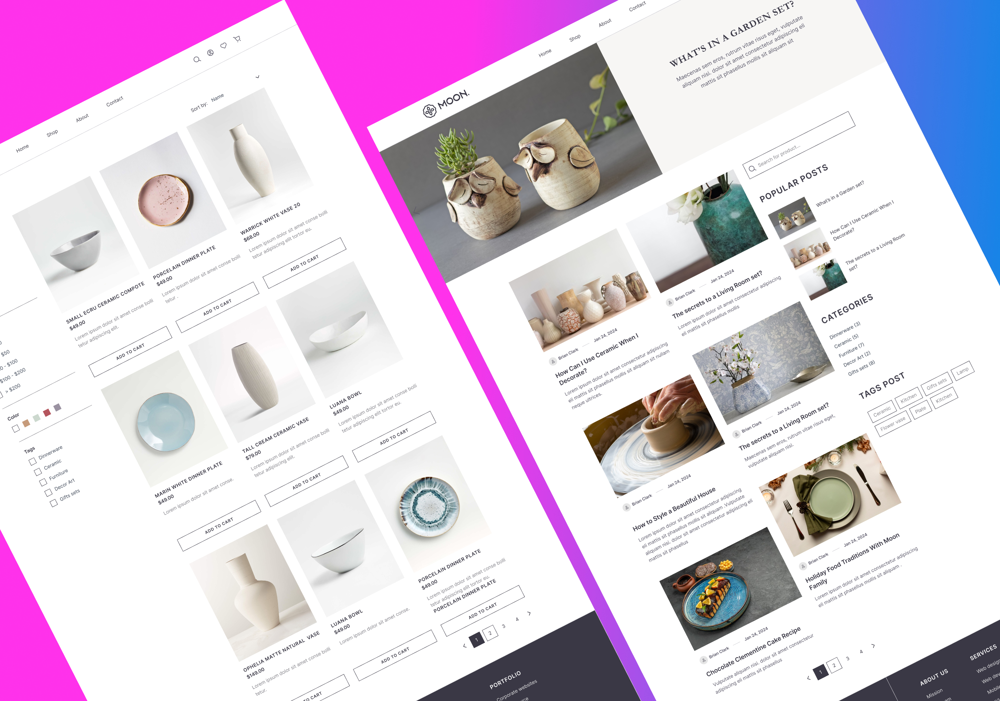
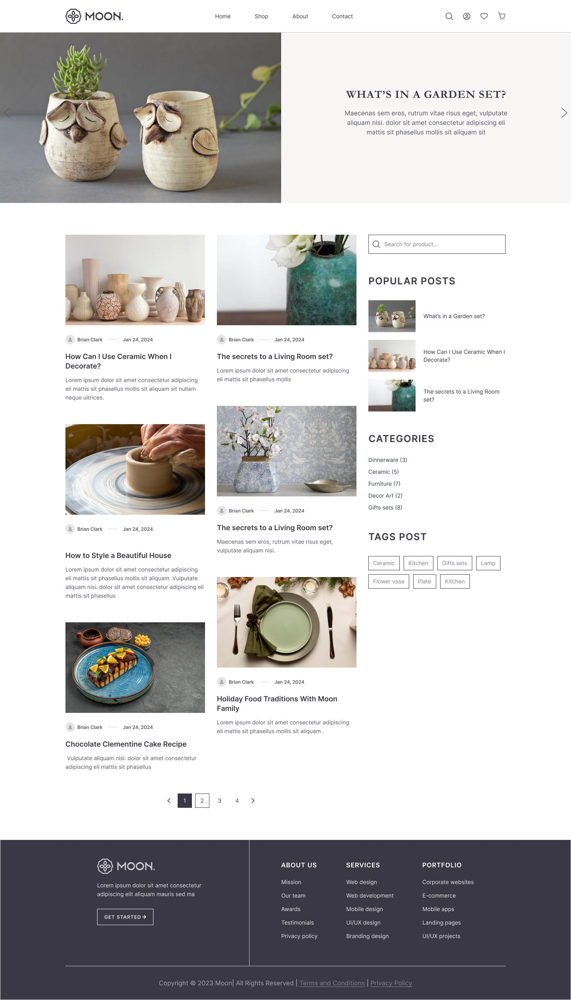

# Moon

This is an e-commerce website for selling decorative tableware.  
[View the live site](https://andriikharchenk.github.io/Moon/)

## Screenshots

<!--  -->

## Technologies
- HTML
- CSS
- SCSS
- JavaScript

## Description
The website showcases a variety of decorative tableware products.  
It’s easy to expand and update with new products.

## Features
- Modern product card design  
- Filters by category and color  
- Responsive grid layout (to be added later)
